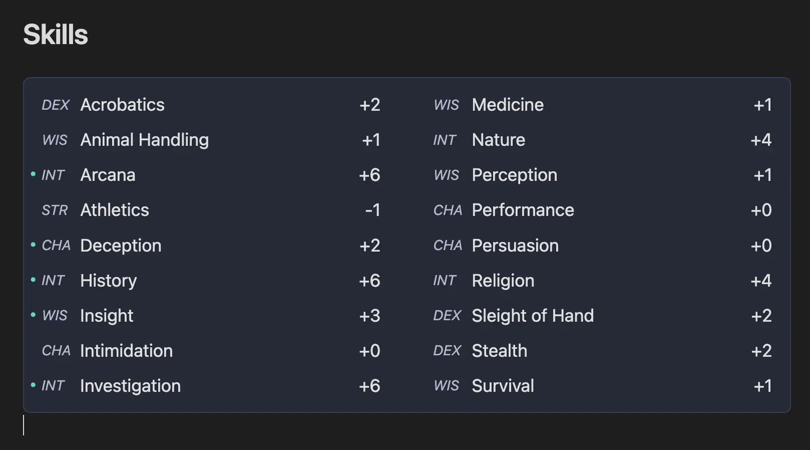
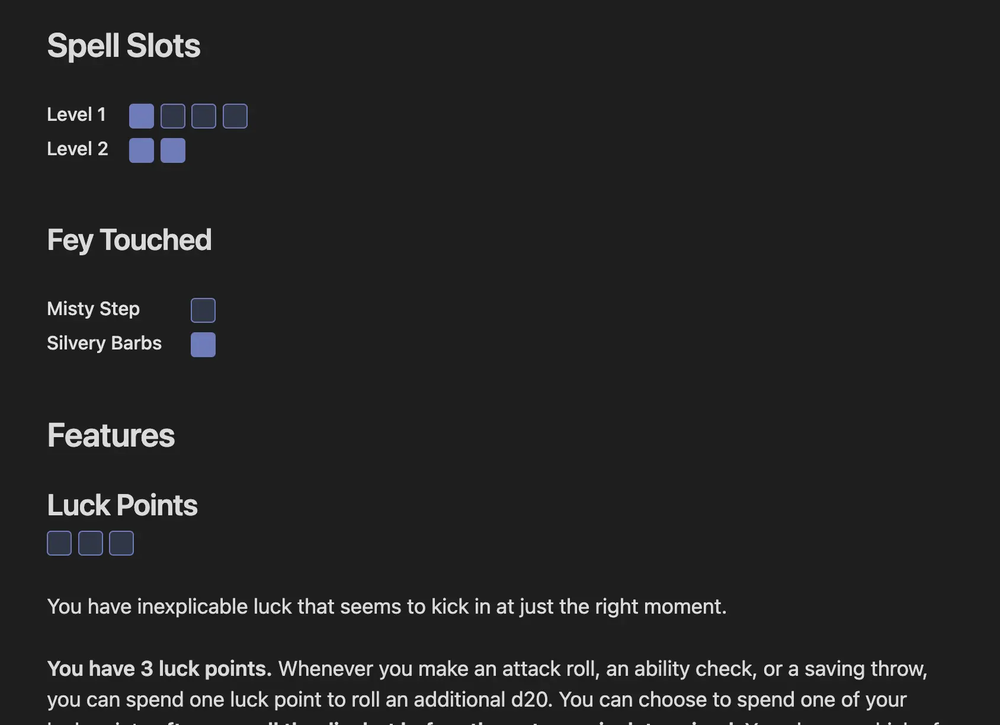
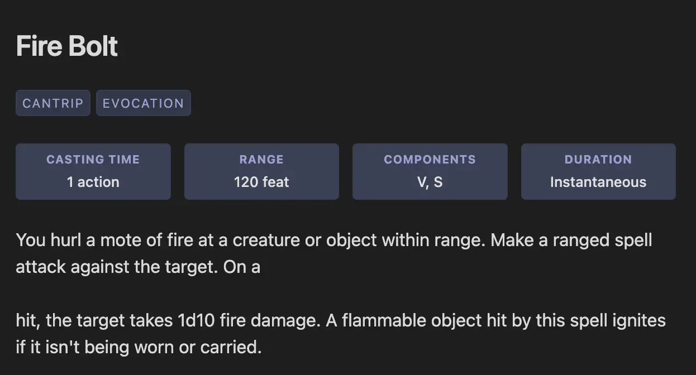

# Obsidian DnD UI Toolkit

This plugin provides modern UI elements for playing Dungeons and Dragons that provide building blocks for you to build
a beautiful markdown driven character sheet.

I built this plugin because I was tired of working with PDFs and online tools to manage my characters. I wanted to keep my notes, spells, and character state (Spell Slots, HP, etc..) all in my notebook. I'm building this plugin to make that process easier.

> [!WARNING]
> This plugin is in early development, things may be broken or change.

## Quick Start

An easy way to get started is to look at an example in the [examples](./docs/examples/) folder and see how those are laid out.

> [!TIP]
> Want to add a new example for your class? Submit a PR with a template!

> [!WARNING]
> We haven't published to the obsidian store yet, if you want to use this plugin you must install it using the [BRAT](https://github.com/TfTHacker/obsidian42-brat) plugin to load the plugin from a git repository.
>
> If you have issues installing with BRAT, try pinning the version to the latest release.

## Features

- Display character information with grid of cards
- Display Ability Scores and saving throws
- Display Skills calculated off ability scores
- HP Widget: Track your characters HP, hit dice, and death saves (also support for monsters)
- Spell Slot Tracking
- General Consumables Tracking
- Initiative Tracker: Combat management with AC, HP, and initiative order
- Spell Components: Display spell casting time, range, components, and duration

## Road Map

Check out the [GitHub Issues](https://github.com/hay-kot/obsidian-dnd-ui-toolkit/issues) for current development plans and progress.

## Components

### Ability Scores

The `ability` block is used to generate a 6 column grid of your ability scores and their savings throws. Fill in the code block with your abilities, proficiencies, and any bonuses that are applied to saving throws.

> [!NOTE]
> Bonuses apply to the saving throws modifier so if the value of the bonus is +2 strength it would add +2 to your saving throw value. If you just want to add a bonus to your strength score, you can increment the number and leave yourself a comment in the code block.


#### Example

````yaml
```ability
abilities:
  strength: 9
  dexterity: 14
  constitution: 14
  intelligence: 19
  wisdom: 12
  charisma: 10

bonuses:
  - name: Right of Power
    target: strength
	value: 2

proficiencies:
  - intelligence
  - wisdom
```
````

### Skills

the `skills` block is used for automatically calculating your skills modifier. It pulls from the first `abilities` block it can find in your file and calculates your scores based on those values.

You can set your proficiencies using the `proficiencies` key and the skills name. Comparisons are case-insensitive.

Additional bonuses can be added to checks for magic items or similar.



#### Example

````yaml
```skills
proficiencies:
  - arcana
  - deception
  - history
  - insight
  - investigation

bonuses:
  - name: Right of Arcana
    target: arcana
	value: 2

proficiencies:
  - deception

expertise:
  - investigation

half_proficiencies:
  - history
```
````

### Stats

Stats are a generic card components that can be used to display all kinds of data like

- Armor Class
- Initiative
- Spell Save DC

Or really anything you'd like. The `sublabel` property is also supported for displaying additional information below the value.


_Note that the example is two stat grids stacked on top of each other_

#### Example

````yaml
```stats
items:
  - label: Armor Class
    sublabel: Mage Armor (16)
    value: 13
  - label: Initiative
    value: '+2'
  - label: Spell DC
    value: 14

grid:
  columns: 3
```
````

## Healthpoints

Healthpoints can be tracked using the `healthpoints` widget. This widget requires a `state_key` be
provided so that the plugin and save the characters state within the Obsidian plugin data. Note
that each `state_key` defined in **any** component needs to be unique as they are all stored within
the same key value store internally.

You can also provide a custom `label` key to override the default `Hit Points`, this is useful if you're
creating an encounter want to track HP of several monsters on a single notebook.

You can also omit the `hitdice` and that part of the component will be omitted from view.

### Death Saves
The health widget includes automatic death save tracking when a character reaches 0 HP. Death saves automatically reset when the character's health returns above 0. You can disable death saves by setting `death_saves: false`.


#### Example

````yaml
```healthpoints
state_key: din_health
health: 24
hitdice:
  dice: d6
  value: 4
```
````

## Badges

The badges component can be used to display any generic Key/Value data in a more condensed view. Badges
also support a `reverse` property, when true it reverses the order of the label and value. You can also
omit the value or label property and it will only render what is provided. This gives you a lot of
flexibility in how they are rendered.


````yaml
```badges
dense: false # optional property, when true makes the badges smaller
items:
  - label: Level
    value: '3'
    reverse: true
  - label: Initiative
    value: '+2'
  - label: Spell Save
    value: 14
  - label: AC
    value: 13
  - label: AC (Mage Armor)
    value: 15
```
````

## Consumables

The `consumable` component allows you to create generic trackers for different states of your character. This can be
for anything like Spell Slots, Luck Points, or Channel Divinity.

Note that the labels field is optional.



````yaml
```consumable
items:
  - label: "Level 1"
    state_key: din_luck_spell_1
    uses: 4
  - label: "Level 2"
    state_key: din_luck_spell_2
    uses: 2
```
````

## Initiative Tracker

The `initiative` component allows you to track combat encounters by managing initiative order, AC, and optionally HP for each combatant. The tracker automatically sorts combatants by their initiative rolls, and provides controls to move through the combat order.

### Basic Example
For single creatures or grouped creatures that share a single HP pool:

````yaml
```initiative
state_key: forest_encounter
items:
  - name: Thordak (Fighter)
    ac: 18
    hp: 45
    link: thordak-character-sheet
  - name: Elf Wizard
    ac: 15
    hp: 28
    link: wizard-npc
  - name: Goblin Warriors (x3)
    ac: 14
    hp: 21
```
````

### Monster Groups Example
For groups of monsters with individual HP tracking:

````yaml
```initiative
state_key: dungeon_encounter
items:
  - name: Party Fighter
    ac: 18
    hp: 45
  - name: Goblin Squad
    ac: 14
    hp:
      Goblin 1: 12
      Goblin 2: 12
      Goblin 3: 12
  - name: Skeleton Archers
    ac: 13
    hp:
      Archer 1: 10
      Archer 2: 10
```
````

## Spell Components

The `spell-components` block allows you to display spell information in a clean, organized format. This is perfect for displaying the key details of spells in your character sheet or spellbook.



#### Example

````yaml
```spell-components
casting_time: 1 action
range: 60 feet
components: V, S, M (a pinch of sulfur)
duration: Instantaneous
```
````

All fields are optional, so you can include only the information you need:

````yaml
```spell-components
casting_time: 1 bonus action
range: Self
duration: Concentration, up to 1 minute
```
````
