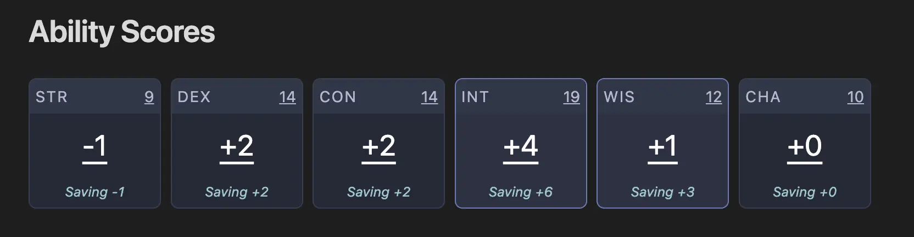

# Ability Scores

The `ability` block is used to generate a 6 column grid of your ability scores and their saving throws. Fill in the code block with your abilities, proficiencies, and any bonuses that are applied to saving throws.

::: info
Bonuses apply to the saving throws modifier so if the value of the bonus is +2 strength it would add +2 to your saving throw value. If you just want to add a bonus to your strength score, you can increment the number and leave yourself a comment in the code block.
:::



## Example

````yaml
```ability
abilities:
  strength: 9
  dexterity: 14
  constitution: 14
  intelligence: 19
  wisdom: 12
  charisma: 10

bonuses:
  - name: Right of Power
    target: strength
    value: 2

proficiencies:
  - intelligence
  - wisdom
```
````

## Configuration

| Property | Type | Description |
|----------|------|-------------|
| `abilities` | Object | Ability score values (strength, dexterity, constitution, intelligence, wisdom, charisma) |
| `bonuses` | Array | List of bonuses to apply to saving throws |
| `proficiencies` | Array | List of abilities you are proficient in for saving throws |

### Bonus Object

| Property | Type | Description |
|----------|------|-------------|
| `name` | String | Name of the bonus (for display purposes) |
| `target` | String | Which ability the bonus applies to |
| `value` | Number | The bonus value to add |