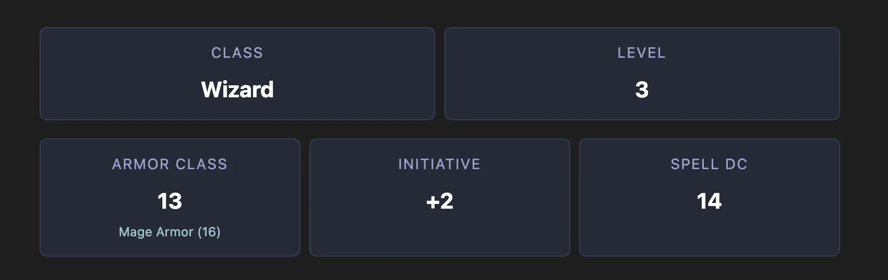

# Stats

Stats are a generic card components that can be used to display all kinds of data like:

- Armor Class
- Initiative
- Spell Save DC
- Or really anything you'd like



_Note that the example is two stat grids stacked on top of each other_

## Dynamic Content

Stats support dynamic content using template variables with `{{ }}` style templates. This allows creating badges with data from the frontmatter or even calculations based off abilities or skills. This is great for things like

- Armor Class
- Attack Bonus
- Initiative

Using dynamic content helps keep your character sheet updated as you level up.

See the [Dynamic Content](../concepts/dynamic-content.md) page for more information on using templates.


## Example

````yaml
```stats
items:
  - label: Armor Class
    sublabel: Mage Armor (16)
    value: 13
  - label: Initiative
    value: '+{{ modifier abilities.dexterity }}'
  - label: Spell DC
    value: 14

grid:
  columns: 3
```
````

## Configuration

| Property | Type   | Description                   |
| -------- | ------ | ----------------------------- |
| `items`  | Array  | List of stat items to display |
| `grid`   | Object | Grid configuration options    |

### Item Object

| Property   | Type          | Description                              |
| ---------- | ------------- | ---------------------------------------- |
| `label`    | String        | The main label for the stat              |
| `value`    | String/Number | The value to display                     |
| `sublabel` | String        | Optional additional text below the value |

### Grid Object

| Property  | Type   | Default | Description                          |
| --------- | ------ | ------- | ------------------------------------ |
| `columns` | Number | 2       | Number of columns in the grid layout |
