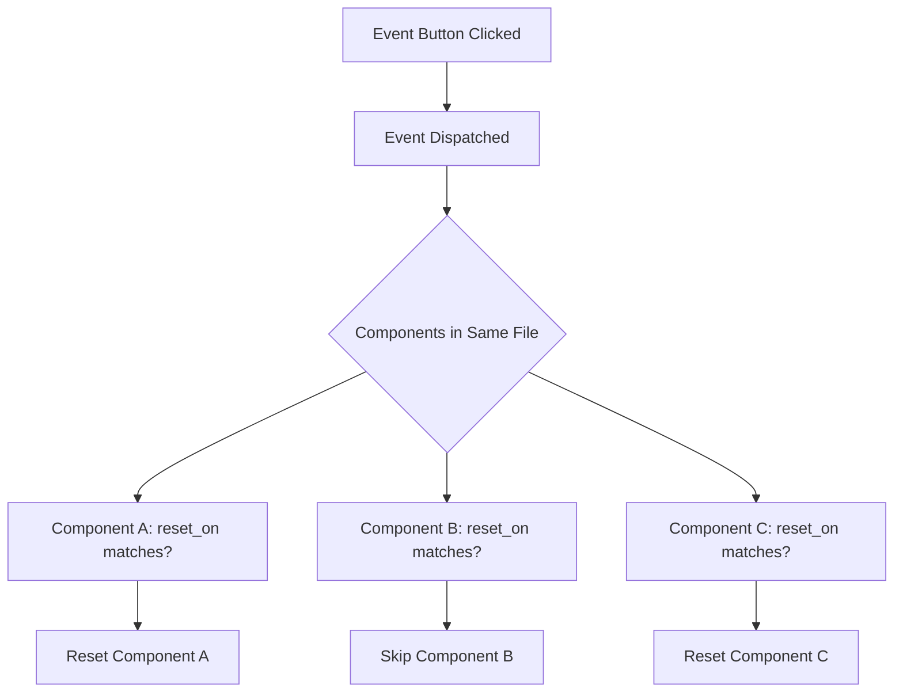

# Event Systems

The DnD UI Toolkit includes a event system that allows components to communicate and reset their state based on in-game events like rests, level-ups, or custom triggers.

## How Events Work

Events in the toolkit are **file-scoped**, meaning they only affect components within the same markdown file. This allows you to have separate event systems for different characters, encounters, or scenarios.

The event system works through two main mechanisms:

1. **Event Triggers** - Components that dispatch events (like [Event Buttons](../components/event-buttons.md))
2. **Event Listeners** - Components that respond to events (like [Consumables](../components/consumables.md) and [Health Points](../components/healthpoints.md))

## Event Flow



## Event Types

You can use any event name that makes sense for your game:

### Common D&D Events

- `short-rest` - Abilities that recharge on short rests
- `long-rest` - Abilities that recharge on long rests
- `new-day` - Daily abilities and resources

::: tip
Events are dynamic and can be anything you want, the important thing is to match the events
in both the button and the component you want to reset.
:::

## Components That Trigger Events

### Event Buttons

The only way to trigger events is through [Event Buttons](../components/event-buttons.md):

````yaml
```event-btns
items:
  - name: Short Rest
    value: short-rest
  - name: Long Rest
    value: long-rest
```
````

## Components That Listen to Events

Any component with a `reset_on` field supports listening for events.

- [Consumables](../components/consumables.md)
- [Health Points](../components/healthpoints.md)

## File Scope Behavior

Events only affect components within the same markdown file. This means:

- Each character sheet can have its own rest system
- Encounter pages can have separate event systems
- You can have multiple characters in different files without interference
